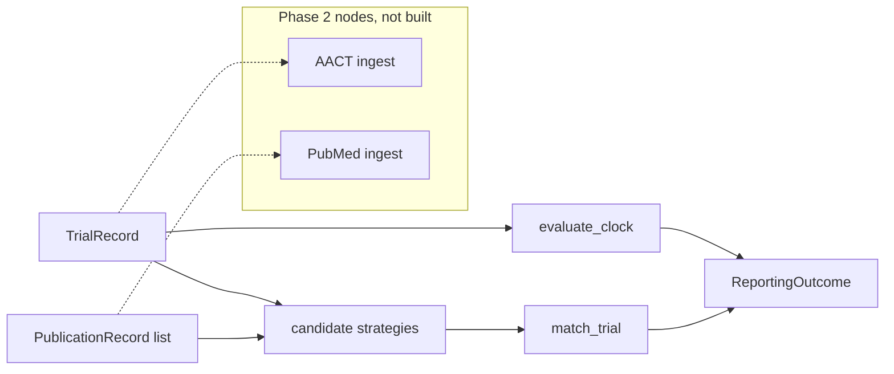

# silent-trials

An explainable linker and a time-aware FDAAA clock that reconciles
registered neuro/psych trials with published outcomes and counts
non-reporting by sponsor without converting matcher error into a ranking.

[](https://github.com/techiegoku2623/silent-trials/actions/workflows/ci.yml)
[](pyproject.toml)
[](LICENSE)

## Status

| Phase | Deliverable | Status |
| --- | --- | --- |
| 0 | Research memo and harnesses | In review — docs/phase-0/research-memo.md |
| 1 | Architecture, schemas, data contracts | Not started |
| 2 | First vertical slice | Not started |
| 3 | Evaluation and demo | Not started |

Status values: Not started / In progress / In review / Merged.

## The problem this solves

Psychiatry and neurology trials finish, skip the results module, and never
become a paper. Sponsor-level "silent trial" rates are then published as if
every unmatched NCT were unreported. Two errors hide in that number: the
typical paper never prints the NCT, and a trial that completed three months
ago is not late under the FDAAA 12-month window.

FDAAA TrialsTracker already scores overdue applicable clinical trials at the
registry layer. It does not link journal articles that omit the identifier,
and it does not tell you what fraction of unmatched NCTs are matcher misses.
That mixture is the claim this repo measures first.

This is research / decision-support tooling. It is not a regulatory
determination of FDAAA 801 compliance and not clinical advice. Phase 0
records are designed synthetic probes, not a live ClinicalTrials.gov dump.

## Walkthrough

Phase 0 ships the designed sample set and the measurement harnesses. The
`silent-trials reconcile` commands below are reserved for Phase 2; running
them now is not implemented on purpose.

### Step 1 — designed sample set

```bash
make setup && make demo
```

`make demo` calls `silent-trials demo-plan`. Actual stdout:

```
silent-trials designed sample cases

S1-nct-in-abstract  NCT00000001
  path:     easy match: publication cites NCT00000001 in the abstract
  expected: MATCH on pub-s1. Decision is nct_in_text. Headline linkage is defensible for this path.

S2-title-pi-condition-date  NCT00000002
  path:     no NCT in the publication; match on title, PI, condition, date window
  expected: MATCH on pub-s2 via title similarity + PI Moreau + major depression + date window. No NCT signal.

S3-not-yet-due  NCT00000003
  path:     completed 4 months ago — within the FDAAA 12-month window, not delinquent
  expected: status = NOT_YET_DUE as of 2026-10-06 with days remaining until 2027-06-06. Do not count as silent.

S4-registry-only  NCT00000004
  path:     completed 3 years ago, results posted to the registry, never journal-published
  expected: REPORTED via registry (REPORTED_REGISTRY). Not silent. Journal absence is recorded, not scored as non-reporting.

S5-ambiguous  NCT00000005
  path:     two plausible candidate publications — matcher returns AMBIGUOUS
  expected: AMBIGUOUS. Matcher does not pick pub-s5a or pub-s5b. Both share PI, condition, and a date window.
```

The records are designed: an NCT hit, a no-NCT hit, a not-yet-due clock, a
registry-only report, and an ambiguous pair. See `data/sample/README.md`.

Recordings `demo/01-reconcile.cast` land in Phase 3.

### Step 2 — NCT-in-text match (Phase 2)

```bash
silent-trials reconcile --nct NCT00000001 --explain
```

Reserved. Sample S1. The evidence for the link is the product, not a score.

### Step 3 — no-NCT match (Phase 2)

```bash
silent-trials reconcile --nct NCT00000002 --explain
```

Reserved. Sample S2. Title, PI, condition, and the date window have to fire
together. Title-only matching is the failure mode S13 exists to catch.

### Step 4 — clock and ambiguity (Phase 2)

```bash
silent-trials reconcile --nct NCT00000003 --explain
silent-trials reconcile --nct NCT00000005 --explain
```

Reserved. S3 must be NOT_YET_DUE. S5 must be AMBIGUOUS. A greedy pick on S5
is a bug.

### Step 5 — registry-only, then the measured baseline

```bash
silent-trials reconcile --nct NCT00000004
make eval
```

`silent-trials reconcile` on S4 is reserved (REPORTED_REGISTRY, not silent).
`make eval` already runs: it regenerates `docs/EVALUATION.md` from the Phase
0 harnesses. The matcher column in Results is that output.

## Layout

Read in this order:

1. `docs/phase-0/research-memo.md` — why the matcher and the failure condition
2. `data/sample/README.md` — why each demo case exists
3. `src/silent_trials/fdaaa.py` — the time-aware 12-month clock
4. `src/silent_trials/matcher.py` — NCT, title, PI+condition+date
5. `research/phase0/` — the three measurements behind the memo
6. `src/silent_trials/cli.py` — demo-plan only, until Phase 2

## Results

Regenerated by `make eval`. Baseline column is mandatory.

<!-- EVAL_TABLE_BEGIN -->

| Measurement | Result | n | Notes |
| --- | --- | --- | --- |
| Matcher MATCH precision | 0.962 | 200 | Floor 0.85 |
| Matcher MATCH recall | 1.000 | 200 | Floor 0.80 |
| Combined candidate-generation recall | 1.000 | 120 | Same 200 |
| Unmatched that are reported-but-unmatched | 0.420 | 100 | Largest error source |
| Live CT.gov / PubMed sponsor ranking | Phase 3 | — | Not pulled |

Headline non-reporting statistic is defensible on this probe set (MATCH precision 0.962 >= 0.85 and recall 1.000 >= 0.80).

<!-- EVAL_TABLE_END -->

## 🏗️ Architecture & Event Topology



`MatchResult.decision` is `AMBIGUOUS` when two candidates clear the
threshold and sit inside the margin. `FdaaaClock.status` is `NOT_YET_DUE`
when the reference date is still inside the 12-month window.

## ⚖️ Architecture Trade-offs & Pragmatic Decisions

| Chosen | Given up | What would change the answer |
| --- | --- | --- |
| Explainable three-signal matcher | Learned neural linker | A live hand-linked set where the neural linker beats 0.85/0.80 and stays explainable |
| Primary completion + 12 months | Study completion, certified delays | Ingest of delay fields that changes S3/S10 |
| Committed probe set instead of AACT dump | Live CT.gov gold | DUA-free Phase 0; replace the 200 before claiming a headline rate |
| AMBIGUOUS as a first-class output | Force-picking the top score | The spec forbids a silent pick |
| Registry results count as reported | Journal-only definition | S4 is the teaching case |

## 🛡️ Edge Cases & Failure Modes

- Completed 3 months ago: NOT_YET_DUE. A time-unaware clock calls this silent.
- Completed 4 months ago: still NOT_YET_DUE (S3). Days remaining are required.
- Results posted, no journal: REPORTED_REGISTRY, not silent (S4).
- Two near-tie papers: AMBIGUOUS, no pick (S5).
- Phase 1 drug, observational, device feasibility, behavioral: NOT_APPLICABLE.
- Same PI, review eight years later: outside the date window (S14).
- Similar title, wrong condition: NO_MATCH (S13).
- Certified delays and good-cause extensions: unmeasured.
- Live author-name variation / PI change: unmeasured.

## Limitations

This is not an FDAAA enforcement list. It does not replace a legal review.
Phase 0 matches designed probe records, not live NCT/PMID pairs. Sponsor
rankings on this probe set are forbidden. No demo recording is committed.
Certified-delay fields are not ingested.

## License and citation

MIT. Cite 42 U.S.C. 282(j) and 42 CFR Part 11 for the results deadline, the
FDAAA TrialsTracker (Powell-Smith / Goldacre, EBM DataLab) for the public
ACT dashboard this repo does not reimplement, and this repository for the
matcher and the unmatched-split measurement.
