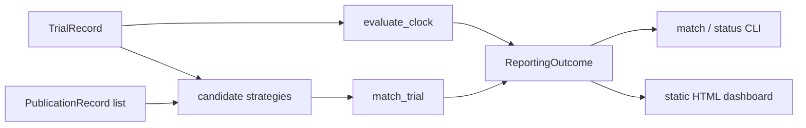

# silent-trials

An explainable linker and a time-aware FDAAA clock that reconciles
registered neuro/psych trials with published outcomes and counts
non-reporting by sponsor without converting matcher error into a ranking.

[](https://github.com/techiegoku2623/silent-trials/actions/workflows/ci.yml)
[](pyproject.toml)
[](LICENSE)

## Status

| Phase | Deliverable | Status |
| --- | --- | --- |
| 0 | Research memo and harnesses | Merged — docs/phase-0/research-memo.md |
| 1 | Architecture, schemas, data contracts | Merged — docs/ARCHITECTURE.md |
| 2 | First vertical slice | Merged — `match` / `status` / `report` |
| 3 | Evaluation and demo | Merged — demo/*.cast |

Status values: Not started / In progress / In review / Merged.

## The problem this solves

Psychiatry and neurology trials finish, skip the results module, and never
become a paper. Sponsor-level "silent trial" rates are then published as if
every unmatched NCT were unreported. Two errors hide in that number: the
typical paper never prints the NCT, and a trial that completed three months
ago is not late under the FDAAA 12-month window.

FDAAA TrialsTracker already scores overdue applicable clinical trials at the
registry layer. It does not link journal articles that omit the identifier,
and it does not tell you what fraction of unmatched NCTs are matcher misses.
That mixture is the claim this repo measures first.

This is research / decision-support tooling. It is not a regulatory
determination of FDAAA 801 compliance and not clinical advice. Records are
designed synthetic probes, not a live ClinicalTrials.gov dump. See
`docs/METHODOLOGY.md`.

## Walkthrough

No credentials. `make demo` runs the full match/status walkthrough on the
designed catalog. Commands below are the same steps, captured as real
stdout (reference date 2026-10-06).

```bash
make setup && make demo
```

### Step 1 — NCT-in-abstract match

```bash
silent-trials match --nct NCT00000001 --explain
```

Actual stdout:

```
NCT00000001  S1-nct-in-abstract
decision:   MATCH
chosen:     pub-s1
rationale:  Single candidate pub-s1 scored 1.75: nct_in_text:NCT00000001; 
title_similarity=0.44; pi_condition_date

candidates (all scored; features shown individually):
  pub-s1  score=1.750  confidence=1.750
    nct_in_text:        yes
    title_similarity:   0.444
    pi_match:           yes
    condition_overlap:  1.000
    date_in_window:     yes
    reasons:            nct_in_text:NCT00000001; title_similarity=0.44; 
pi_condition_date

Research tool only. This output is not a determination of FDAAA 801 compliance 
and is not clinical advice. Phase 0 records are designed synthetic probes, not a
live ClinicalTrials.gov or PubMed dump.
```

### Step 2 — no NCT; title / PI / condition / date

```bash
silent-trials match --nct NCT00000002 --explain
```

Actual stdout:

```
NCT00000002  S2-title-pi-condition-date
decision:   MATCH
chosen:     pub-s2
rationale:  Single candidate pub-s2 scored 1.00: title_similarity=1.00; 
pi_condition_date

candidates (all scored; features shown individually):
  pub-s2  score=1.000  confidence=1.000
    nct_in_text:        no
    title_similarity:   1.000
    pi_match:           yes
    condition_overlap:  1.000
    date_in_window:     yes
    reasons:            title_similarity=1.00; pi_condition_date

Research tool only. This output is not a determination of FDAAA 801 compliance 
and is not clinical advice. Phase 0 records are designed synthetic probes, not a
live ClinicalTrials.gov or PubMed dump.
```

### Step 3 — AMBIGUOUS; matcher does not pick

```bash
silent-trials match --nct NCT00000005 --explain
```

Actual stdout:

```
NCT00000005  S5-ambiguous
decision:   AMBIGUOUS
chosen:     (none — matcher does not pick)
rationale:  pub-s5a (1.00) and pub-s5b (0.87) both clear the threshold and are 
within 0.22; matcher does not pick.

candidates (all scored; features shown individually):
  pub-s5a  score=1.000  confidence=1.000
    nct_in_text:        no
    title_similarity:   1.000
    pi_match:           yes
    condition_overlap:  1.000
    date_in_window:     yes
    reasons:            title_similarity=1.00; pi_condition_date
  pub-s5b  score=0.871  confidence=0.871
    nct_in_text:        no
    title_similarity:   0.714
    pi_match:           yes
    condition_overlap:  1.000
    date_in_window:     yes
    reasons:            title_similarity=0.71; pi_condition_date

AMBIGUOUS: 2 candidates clear the 0.50 threshold and sit inside the margin. 
Matcher does not pick.

Research tool only. This output is not a determination of FDAAA 801 compliance 
and is not clinical advice. Phase 0 records are designed synthetic probes, not a
live ClinicalTrials.gov or PubMed dump.
```

### Step 4 — clock: NOT_YET_DUE

```bash
silent-trials status --nct NCT00000003
```

Actual stdout:

```
NCT00000003  S3-not-yet-due
status:          NOT_YET_DUE
clock status:    NOT_YET_DUE
reference date:  2026-10-06
completion:      2026-06-06 (primary)
due date:        2027-06-06
days remaining:  243
days elapsed:    122
applicable:      yes
rationale:       Primary completion 2026-06-06 plus 12 months is 2027-06-06. 243
days remain as of 2026-10-06.

Research tool only. This output is not a determination of FDAAA 801 compliance 
and is not clinical advice. Phase 0 records are designed synthetic probes, not a
live ClinicalTrials.gov or PubMed dump.
```

### Step 5 — clock: REPORTED via registry, then eval

```bash
silent-trials status --nct NCT00000004
make eval
```

Actual stdout of `status`:

```
NCT00000004  S4-registry-only
status:          REPORTED
posting route:   registry results module (REPORTED_REGISTRY)
registry posted: 2024-09-01
clock status:    REPORTED_REGISTRY
reference date:  2026-10-06
completion:      2023-10-06 (primary)
due date:        2024-10-06
days remaining:  -730
days elapsed:    1096
applicable:      yes
rationale:       Results information is posted to the registry. Absence of a 
journal article does not make this trial silent.

Research tool only. This output is not a determination of FDAAA 801 compliance 
and is not clinical advice. Phase 0 records are designed synthetic probes, not a
live ClinicalTrials.gov or PubMed dump.
```

`make eval` regenerates `docs/EVALUATION.md` from the Phase 0–3 harnesses:
MATCH precision/recall, per-strategy candidate recall, and the
unreported-vs-unmatched split with Wilson 95% bounds. Unmatched is not
silent.

Optional public dashboard (static HTML, no credentials):

```bash
make report
```

writes `docs/dashboard.html` from the sample catalog.

Recordings: `demo/01-matching-explained.cast`,
`demo/02-ambiguity-and-clock.cast`, `demo/03-evaluation.cast`.

## Layout

Read in this order:

1. `docs/METHODOLOGY.md` — what a number is allowed to mean
2. `docs/ARCHITECTURE.md` — contracts the CLI shares
3. `docs/phase-0/research-memo.md` — why the matcher and the failure condition
4. `data/sample/README.md` — why each demo case exists
5. `src/silent_trials/fdaaa.py` — the time-aware 12-month clock
6. `src/silent_trials/matcher.py` — NCT, title, PI+condition+date
7. `research/phase0/` — the three measurements behind the memo
8. `src/silent_trials/cli.py` — `match`, `status`, `report`, `demo`

## Results

Regenerated by `make eval`. Baseline column is mandatory.

<!-- EVAL_TABLE_BEGIN -->

| Measurement | Result | n | Notes |
| --- | --- | --- | --- |
| Matcher MATCH precision | 0.962 | 200 | Floor 0.85 |
| Matcher MATCH recall | 1.000 | 200 | Floor 0.80 |
| Combined candidate-generation recall | 1.000 | 120 | Same 200 |
| Unmatched that are reported-but-unmatched | 0.420 (Wilson 95% 0.328–0.518) | 100 | Not a silence count |
| Unmatched that are genuinely unreported | 0.580 (Wilson 95% 0.482–0.672) | 100 | Adjudicated remainder |
| Live CT.gov / PubMed sponsor ranking | unmeasured | — | Not pulled |

Headline non-reporting statistic is defensible on this probe set (MATCH precision 0.962 >= 0.85 and recall 1.000 >= 0.80).

<!-- EVAL_TABLE_END -->

## 🏗️ Architecture & Event Topology



`MatchResult.decision` is `AMBIGUOUS` when two candidates clear the
threshold and sit inside the margin. `FdaaaClock.status` is `NOT_YET_DUE`
when the reference date is still inside the 12-month window. Headline
`REPORTED` names the posting route.

## ⚖️ Architecture Trade-offs & Pragmatic Decisions

| Chosen | Given up | What would change the answer |
| --- | --- | --- |
| Explainable three-signal matcher | Learned neural linker | A live hand-linked set where the neural linker beats 0.85/0.80 and stays explainable |
| Primary completion + 12 months | Study completion, certified delays | Ingest of delay fields that changes S3/S10 |
| Committed probe set instead of AACT dump | Live CT.gov gold | DUA-free Phase 0; replace the 200 before claiming a headline rate |
| AMBIGUOUS as a first-class output | Force-picking the top score | The spec forbids a silent pick |
| Registry results count as reported | Journal-only definition | S4 is the teaching case |

## 🛡️ Edge Cases & Failure Modes

- Completed 3 months ago: NOT_YET_DUE. A time-unaware clock calls this silent.
- Completed 4 months ago: still NOT_YET_DUE (S3). Days remaining are required.
- Results posted, no journal: REPORTED via registry, not silent (S4).
- Two near-tie papers: AMBIGUOUS, no pick (S5).
- Phase 1 drug, observational, device feasibility, behavioral: NOT_APPLICABLE.
- Same PI, review eight years later: outside the date window (S14).
- Similar title, wrong condition: NO_MATCH (S13).
- Certified delays and good-cause extensions: unmeasured.
- Live author-name variation / PI change: unmeasured.
- Unmatched ≠ unreported. Wilson bounds sit on the committed split.

## Limitations

This is not an FDAAA enforcement list. It does not replace a legal review.
The matcher and clock run on designed probe records, not live NCT/PMID
pairs. Sponsor rankings on this probe set are forbidden. Certified-delay
fields are not ingested. See `docs/METHODOLOGY.md`.

## License and citation

MIT. Cite 42 U.S.C. 282(j) and 42 CFR Part 11 for the results deadline, the
FDAAA TrialsTracker (Powell-Smith / Goldacre, EBM DataLab) for the public
ACT dashboard this repo does not reimplement, and this repository for the
matcher and the unmatched-split measurement.
